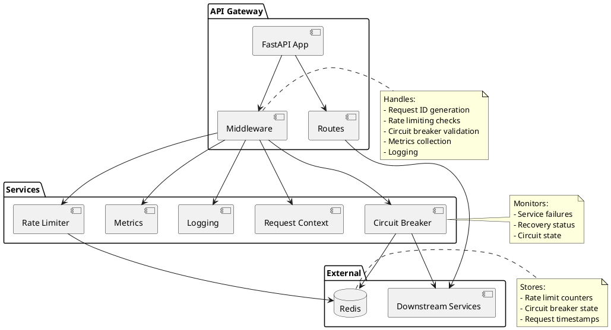
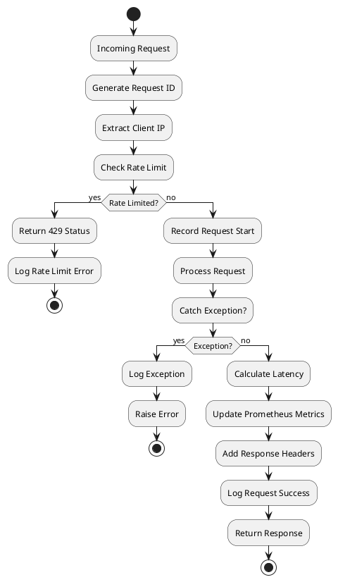

# API Gateway

A robust API Gateway built with FastAPI featuring rate limiting, request logging, metrics collection, and middleware management.

## Features

- ✅ **Rate Limiting** - Sliding window rate limiter using Redis
- ✅ **Circuit Breaker** - Prevents cascading failures with automatic recovery
- ✅ **Request Logging** - Structured JSON logging with request context
- ✅ **Metrics** - Prometheus metrics for monitoring
- ✅ **Request Context** - Request ID tracking across the system
- ✅ **Health Check** - Built-in health check endpoint

## Architecture



## Request Flow Diagram



## Project Structure

```
apiGateway/
├── app/
│   ├── __init__.py
│   ├── main.py                 # FastAPI application entry point
│   ├── cache/
│   │   └── redis_client.py     # Redis connection management
│   ├── core/
│   │   ├── config.py           # Configuration settings
│   │   ├── logging.py          # Logging setup
│   │   ├── metrics.py          # Prometheus metrics
│   │   └── middleware.py       # Request middleware
│   ├── gateway/
│   │   └── rate_limiter.py     # Rate limiting logic
│   ├── observability/
│   ├── services/
│   └── utils/
├── tests/
│   ├── test_health.py
│   ├── test_metrics.py
│   └── test_rate_limiter.py
├── docker/
│   └── docker-compose.yml      # Docker composition
├── requirements.txt            # Python dependencies
└── Readme.md                   # This file
```

## Installation

### Prerequisites
- Python 3.10+
- Redis 7+
- Docker & Docker Compose (optional)

### Local Setup

1. **Clone the repository**
```bash
git clone https://github.com/lakshheera07/API-Gateway.git
cd apiGateway
```

2. **Create virtual environment**
```bash
python -m venv venv
source venv/bin/activate  # On Windows: venv\Scripts\activate
```

3. **Install dependencies**
```bash
pip install -r requirements.txt
```

4. **Start Redis** (if not using Docker)
```bash
redis-server
```

## Running the Project

### Local Development
```bash
python -m app.main
```
The API will be available at `http://127.0.0.1:8000`

### With Docker
```bash
docker-compose -f docker/docker-compose.yml up
```

## API Endpoints

### Health Check
```bash
curl http://127.0.0.1:8000/health
```

**Response:**
```json
{"status": "ok"}
```

### Metrics
```bash
curl http://127.0.0.1:8000/metrics
```

Returns Prometheus-formatted metrics.

## Configuration

Update settings in `app/core/config.py`:

```python
class Settings(BaseSettings):
    redis_host: str = "localhost"
    redis_port: int = 6379
    RATE_LIMIT_REQUESTS: int = 100          # Requests per window
    RATE_LIMIT_WINDOW_SEC: int = 60         # Time window in seconds
    CIRCUIT_FAILURE_THRESHOLD: int = 5      # Failures before circuit opens
    CIRCUIT_RECOVERY_TIMEOUT: int = 30      # Seconds before attempting recovery
```

## Circuit Breaker

The Circuit Breaker pattern prevents cascading failures by monitoring downstream service health:

### States
- **CLOSED** (Normal) - Requests flow normally, failures are counted
- **OPEN** (Failed) - Requests are rejected immediately, returns HTTP 503
- **HALF_OPEN** (Recovering) - Limited requests allowed to test service recovery

### Configuration
```python
CIRCUIT_FAILURE_THRESHOLD: int = 5      # Open circuit after 5 failures
CIRCUIT_RECOVERY_TIMEOUT: int = 30      # Wait 30 seconds before retry
```

### How It Works
1. Track failures for each service
2. When failures exceed threshold → Circuit opens
3. Reject all requests with HTTP 503 (Service Unavailable)
4. After timeout, allow one request to test recovery
5. If successful → Circuit closes, resume normal operation
6. If fails → Circuit stays open, retry after timeout

### Usage Example
```python
from app.gateway.circuit_breaker import CircuitBreaker

breaker = CircuitBreaker("downstream_service")

if breaker.is_open():
    raise HTTPException(status_code=503, detail="Circuit open")

try:
    response = call_downstream_service()
    breaker.record_success()
except Exception as e:
    breaker.record_failure()
    raise
```

### Testing Circuit Breaker
```bash
# Simulate failures to trigger circuit breaker
curl -X POST http://127.0.0.1:8000/simulate-failure

# Check circuit status
curl http://127.0.0.1:8000/health  # Should return 503 if circuit is open
```

## Rate Limiting

The API Gateway implements a **sliding window rate limiter** using Redis:

- **Algorithm**: Sliding window with sorted sets
- **Storage**: Redis
- **Default Limit**: 100 requests per 60 seconds
- **Response**: HTTP 429 when limit exceeded

### How It Works
1. For each client IP, maintain a sorted set of request timestamps
2. Remove old timestamps outside the window
3. Check if current request count exceeds limit
4. Add current timestamp to the set

### Test Rate Limiting
```bash
# Bash
for i in {1..120}; do curl -s http://127.0.0.1:8000/health; done

# PowerShell
for ($i=1; $i -le 120; $i++) { Invoke-WebRequest -Uri http://127.0.0.1:8000/health }

# Windows CMD
for /L %i in (1,1,120) do curl -s http://127.0.0.1:8000/health
```

You should see 429 (Too Many Requests) responses after 100 requests.

## Testing

Run all tests:
```bash
pytest
```

Run specific tests:
```bash
pytest tests/test_health.py -v
pytest tests/test_rate_limiter.py -v
pytest tests/test_circuit_breaker.py -v
pytest tests/test_metrics.py -v
```

## Logging

All requests are logged with structured JSON output including:
- Request ID
- Timestamp
- HTTP method and endpoint
- Response status code
- Processing latency
- Request details

## Metrics

Prometheus metrics are collected for:
- `http_requests_total` - Total HTTP requests by method, endpoint, status
- `http_request_latency_ms` - Request latency in milliseconds with histograms

Access metrics at `/metrics` endpoint.

## Error Handling

- **429 Too Many Requests** - Rate limit exceeded
- **500 Internal Server Error** - Unhandled exceptions with logging
- **422 Unprocessable Entity** - Validation errors

## Contributing

1. Create a feature branch: `git checkout -b feature/your-feature`
2. Commit changes: `git commit -am 'Add feature'`
3. Push to branch: `git push origin feature/your-feature`
4. Submit a pull request


## Contact

For issues and questions, please create a GitHub issue at [API-Gateway Issues](https://github.com/lakshheera07/API-Gateway/issues)

---

**Last Updated**: February 4, 2026
